# Agentropolis — Complete Technical Deep-Dive

> **"SimCity meets DeFi."** — A gamified DeFi trading platform built for HackMoney 2026 where AI agents collaborate in a virtual city, debate trading strategies in a council room, and execute real on-chain swaps.

---

## What It Does (The Core Loop)

```mermaid
flowchart LR
    A["🔗 Connect Wallet"] --> B["⚡ Start Yellow Session"]
    B --> C["🤖 Deploy Agents from ERC-8004 Registry"]
    C --> D["🏛️ Enter Council Room"]
    D --> E["🧠 AI Agents Deliberate via Groq LLM"]
    E --> F["📜 User Reviews Proposal"]
    F -->|Approve| G["🦄 Execute Uniswap v4 Swap On-Chain"]
    F -->|Reject| D
    G --> H["🔚 End Session → Settlement"]
```



The user interacts with a **cyberpunk isometric city** rendered via Phaser 3. They deploy AI agents (discovered from an on-chain ERC-8004 registry), watch them debate in a council room, and approve/reject trade proposals that execute **real Uniswap v4 swaps on Base Sepolia**.

---

## Tech Stack

| Layer | Technology | Purpose |
|-------|-----------|---------|
| **Frontend** | Next.js 14 (App Router), React 18 | Core web framework |
| **Game Engine** | Phaser 3 + Three.js + React Three Fiber | Isometric city & 3D council view |
| **Styling** | Tailwind CSS | UI components |
| **Web3** | wagmi v3, viem v2 | Wallet connection, contract interactions |
| **AI** | Groq SDK → `llama-3.3-70b-versatile` | Multi-agent deliberation |
| **State Channels** | Yellow Network (`@erc7824/nitrolite`) | Off-chain micropayments |
| **DEX** | Uniswap v4 Universal Router | On-chain swaps |
| **Token Launch** | Clanker SDK v4 | Memecoin deployment with v4 hooks |
| **Identity** | ENS (Ethereum Name Service) | Name resolution, avatar, config storage |
| **Micropayments** | x402 Protocol | HTTP-level payments for external agents |
| **Smart Contracts** | Solidity 0.8.26, Foundry | Uniswap v4 custom hooks |
| **Monorepo** | Turborepo + Bun | Build orchestration |
| **Chain** | Base Sepolia (testnet), Ethereum Sepolia (ENS) | Deployment target |

---

## Architecture

```mermaid
graph TB
    subgraph Frontend["Frontend (Next.js + Phaser/Three.js)"]
        LP["Landing Page"]
        CV["CityView3D — Isometric City"]
        CR["CouncilRoom3D — Roundtable Deliberation"]
        SH["SwapHandler — Event Listener"]
        SP["SessionProvider — Yellow Channel"]
        UI["UserIdentity — ENS Display"]
        AS["AgentSettings — BYOA Config"]
    end

    subgraph API["API Routes (Next.js)"]
        AL["/api/agents/list"]
        AC["/api/agents/council"]
        AP["/api/agents/propose"]
        AT["/api/agents/launch-token"]
    end

    subgraph Integrations["Integration Libraries"]
        YL["Yellow Network — State Channels"]
        UNI["Uniswap v4 — Swap Executor"]
        ENS["ENS — Identity + Text Records"]
        ERC["ERC-8004 — Agent Discovery"]
        X4["x402 — HTTP Micropayments"]
        CL["Clanker — Token Launches"]
    end

    subgraph Contracts["Solidity Hooks (Base Sepolia)"]
        CFH["CouncilFeeHook — Dynamic Fees"]
        SOH["SentimentOracleHook — Market Oracle"]
        SGH["SwapGuardHook — Risk Limits"]
    end

    CV --> CR
    CR -->|"User Prompt"| AC
    AC -->|"Groq LLM"| AP
    AP -->|"Proposal"| SH
    SH -->|"Execute"| UNI
    UNI --> Contracts
    SP --> YL
    AL --> ERC
    AT --> CL
    AS -->|"BYOA Endpoint"| X4
    UI --> ENS
```



---

## Monorepo Structure

```
agentropolis/
├── apps/
│   ├── web/                          # Main Next.js 14 application
│   │   ├── app/                      # Pages (landing, app, docs)
│   │   │   ├── page.tsx              # Landing page
│   │   │   ├── app/page.tsx          # Main game view
│   │   │   └── api/agents/           # 4 API routes
│   │   ├── components/
│   │   │   ├── game/                 # Phaser + Three.js game views
│   │   │   │   ├── CityView3D.tsx    # Isometric city (Three.js)
│   │   │   │   ├── CouncilRoom3D.tsx # Council deliberation (Three.js)
│   │   │   │   ├── GameComponent.tsx # Phaser wrapper
│   │   │   │   └── scenes/           # Phaser scenes (City, Council)
│   │   │   ├── SessionProvider.tsx   # Yellow session management
│   │   │   ├── SwapHandler.tsx       # Uniswap execution bridge
│   │   │   ├── UserIdentity.tsx      # ENS name + avatar
│   │   │   ├── AgentSettings.tsx     # BYOA endpoint config
│   │   │   └── PlaceOrderModal.tsx   # Order placement UI
│   │   └── lib/
│   │       ├── uniswap/             # Swap + LP execution
│   │       ├── yellow/              # State channel management
│   │       ├── agents/              # AI council + strategies
│   │       ├── ens/                 # ENS resolution + text records
│   │       ├── erc8004/             # On-chain agent registry
│   │       ├── clanker/             # Token launch via Clanker SDK
│   │       └── x402/               # HTTP micropayment wrapper
│   ├── new/                          # Alternate frontend (WIP)
│   └── web-3d/                       # Standalone 3D experiment
├── packages/
│   ├── contracts/                    # Foundry project
│   │   └── src/
│   │       ├── CouncilFeeHook.sol    # Dynamic fee hook
│   │       ├── SentimentOracleHook.sol # Market sentiment oracle
│   │       └── SwapGuardHook.sol     # Swap size limiter
│   └── shared/                       # Shared TypeScript types
│       └── src/types.ts              # All domain interfaces
├── turbo.json                        # Turborepo config
└── package.json                      # Root workspace config
```

---

## Deep-Dive: Key Subsystems

### 1. 🧠 AI Council System — [council.ts](file:///Users/utkarshraj/Documents/Summer_of_bitcoin/Agentropolis/apps/web/lib/agents/council.ts)

The **core differentiator** — a multi-agent deliberation engine using **Groq LLM** (`llama-3.3-70b-versatile`).

**5 AI Agent Personas:**

| Agent | Role | Behavior |
|-------|------|----------|
| 🎯 Alpha Hunter | Seeks yield | Optimistic, supports high APY opportunities |
| 🛡️ Risk Sentinel | Risk assessor | Conservative, **can VETO** dangerous proposals |
| 🔮 Macro Oracle | Market context | Neutral, provides sentiment and timing analysis |
| 😈 Devil's Advocate | Challenges | Skeptical, presents worst-case scenarios |
| 📋 Council Clerk | Synthesizer | Creates the final proposal from all opinions |

**Flow:**
1. User enters a prompt (e.g., "I want passive income from my 0.1 ETH")
2. Each agent receives the prompt + previous agents' opinions (sequential context passing)
3. Each outputs structured JSON: `{ opinion, reasoning, confidence, suggestedStrategy }`
4. Clerk synthesizes into a `TradeProposal` with: strategy type, token pair, amounts, risk level
5. Consensus is computed: `unanimous | majority | contested | vetoed`

**Strategy Types:** `swap`, `dca`, `lp_full_range`, `lp_concentrated`, `token_launch`

**BYOA (Bring Your Own Agent):** Users can plug in external AI agent endpoints. Calls are made via x402 micropayments with SSRF protection and 10s timeout.

---

### 2. 🦄 Uniswap v4 Executor — [executor.ts](file:///Users/utkarshraj/Documents/Summer_of_bitcoin/Agentropolis/apps/web/lib/uniswap/executor.ts)

Executes **real on-chain swaps** on Base Sepolia via the Universal Router.

**Key technical details:**
- Uses `V4_SWAP` command (`0x10`) with the Universal Router ABI
- Encodes V4 actions: `SWAP_EXACT_IN_SINGLE` → `SETTLE_ALL` → `TAKE_ALL`
- Handles ERC-20 approvals, balance checks, gas simulation
- 3% default slippage protection
- Pre-flight simulation via `eth_call` before sending transactions
- Returns `SwapReceipt` with realized amounts and slippage vs. quote

**Contract Addresses (Base Sepolia):**
- Universal Router: `0x492E6456D9528771018DeB9E87ef7750EF184104`
- Pool Manager: `0x05E73354cFDd6745C338b50BcFDfA3Aa6fA03408`
- WETH: `0x4200000000000000000000000000000000000006`
- USDC: `0x036CbD53842c5426634e7929541eC2318f3dCF7e`

---

### 3. ⚡ Yellow Network Integration — [channel.tsx](file:///Users/utkarshraj/Documents/Summer_of_bitcoin/Agentropolis/apps/web/lib/yellow/channel.tsx)

Implements **state channel sessions** for gasless, instant micro-actions using `@erc7824/nitrolite`.

**Lifecycle:**
1. **Deposit** → User deposits funds to Yellow's custody contract on-chain
2. **Create Channel** → Opens a state channel via WebSocket to ClearNode
3. **Off-chain Transfers** → Agent deployments are instant micropayments (no gas)
4. **Close Channel** → Settles all state deltas back on-chain

Has both `createRealChannelManager` (production) and `createMockChannelManager` (demo mode).

---

### 4. 📛 ENS Integration — [textRecords.ts](file:///Users/utkarshraj/Documents/Summer_of_bitcoin/Agentropolis/apps/web/lib/ens/textRecords.ts)

- **Identity display**: Resolves ENS names and avatars for the connected wallet
- **Config persistence**: Saves/loads BYOA agent endpoint URL to ENS text records
- **Subnames**: Support for ENS subname management

---

### 5. 🤖 ERC-8004 Agent Registry — [client.ts](file:///Users/utkarshraj/Documents/Summer_of_bitcoin/Agentropolis/apps/web/lib/erc8004/client.ts)

Discovers AI agents from an **on-chain registry** on Base Sepolia:
- Queries `IdentityRegistry` contract for agent metadata URIs (supports IPFS)
- Queries `ReputationRegistry` for reputation scores (0-100)
- Links to 8004scan.io for block explorer viewing
- Falls back to mock agents if registry is empty

---

### 6. 💰 x402 Micropayments — [client.ts](file:///Users/utkarshraj/Documents/Summer_of_bitcoin/Agentropolis/apps/web/lib/x402/client.ts)

HTTP-level micropayment protocol for paying external BYOA agents:
- Wraps native `fetch` with `@x402/fetch` for automatic payment negotiation
- Uses EVM `exact` scheme with the connected wallet's `signTypedData`
- Transparent to the calling code — just use the wrapped fetch

---

### 7. 🚀 Clanker Token Launcher — [client.ts](file:///Users/utkarshraj/Documents/Summer_of_bitcoin/Agentropolis/apps/web/lib/clanker/client.ts)

Launches memecoins with Uniswap v4 hooks via the Clanker SDK:
- Deploys ERC-20 token with metadata, reward recipients, and optional vault locking
- Integrated into the council flow — agents can propose token launches
- Requires Base Mainnet (falls back to mock on testnet)

---

## Smart Contracts (Uniswap v4 Hooks)

Three custom **Uniswap v4 hooks** written in Solidity 0.8.26 using Foundry:

### [CouncilFeeHook.sol](file:///Users/utkarshraj/Documents/Summer_of_bitcoin/Agentropolis/packages/contracts/src/CouncilFeeHook.sol)
- **Hook type:** `beforeSwap`
- **What it does:** AI council votes on swap fees; the hook dynamically overrides the LP fee using `LPFeeLibrary.OVERRIDE_FEE_FLAG`
- **Range:** 0.001% – 1% (10–10,000 bps)

### [SentimentOracleHook.sol](file:///Users/utkarshraj/Documents/Summer_of_bitcoin/Agentropolis/packages/contracts/src/SentimentOracleHook.sol)
- **Hook type:** `afterSwap`
- **What it does:** Records council's market sentiment (-100 to +100) as an on-chain oracle after each swap
- **API:** `getSentiment()` returns `(score, swapCount, lastUpdated, reason)`

### [SwapGuardHook.sol](file:///Users/utkarshraj/Documents/Summer_of_bitcoin/Agentropolis/packages/contracts/src/SwapGuardHook.sol)
- **Hook type:** `beforeSwap`
- **What it does:** Risk Sentinel agent sets `maxSwapSize`; any swap exceeding it is **reverted**
- **Safety:** Minimum 0.01 ETH threshold to prevent lockout

---

## Shared Type System — [types.ts](file:///Users/utkarshraj/Documents/Summer_of_bitcoin/Agentropolis/packages/shared/src/types.ts)

Key interfaces powering the entire flow:

| Type | Purpose |
|------|---------|
| `TradeProposal` | Full swap proposal with pair, amounts, risk, deliberation, execution plan |
| `TokenLaunchProposal` | Memecoin launch proposal with name, symbol, vault % |
| `DeliberationResult` | Council messages + consensus + vote tally |
| `CouncilMessage` | Individual agent opinion with role, confidence, reasoning |
| `ExecutionPlan` | Pre-flight plan: quote + slippage + simulation result |
| `SwapReceipt` | Post-execution: tx hash, balances, realized slippage |
| `AgentProfile` | Agent identity from ERC-8004 with strategy & reputation |
| `YellowSession` | State channel session metadata |

---

## Sponsor Integration Summary

| Sponsor | Prize Track | What's Implemented |
|---------|------------|-------------------|
| **Yellow Network** | $15,000 | State channel sessions via Nitrolite, gasless agent deployment, on-chain settlement |
| **Uniswap Foundation** | $10,000 | V4_SWAP command encoding, Universal Router execution, 3 custom hooks, LP + concentrated liquidity |
| **ENS** | $5,000 | Reverse resolution, avatar display, text record storage for BYOA config, subnames |

---

## How to Run

```bash
# Install dependencies
bun install

# Build shared package
cd packages/shared && bun run build && cd ../..

# Run dev server
cd apps/web && bun run dev
# → Open http://localhost:3000
```

**Environment Variables** (`apps/web/.env.local`):
```
GROQ_API_KEY=your_key        # AI deliberation (or use GROQ_MOCK=true)
NEXT_PUBLIC_UNISWAP_MOCK=true # Mock swaps for demo
ERC8004_MOCK=true             # Mock agent registry
```
